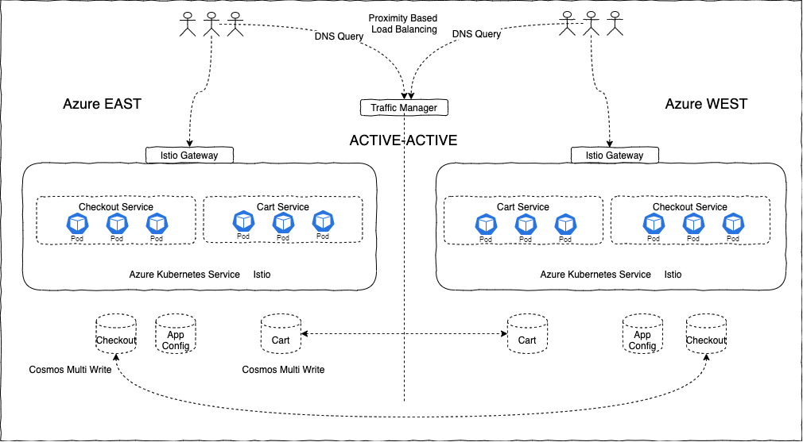

# Highly_available_microservices_architecture_deployment_solution_e-commerce

# About
We will discuss the architecture of a cloud-native E-Commerce platform on the public cloud. We will discuss the problems on hand, the motivation behind building such a new platform, the Architecture guidelines and the operating principles we followed, the technology stack we choose, and the rationale behind such decisions.

These problems motivated us to build a new platform from scratch using modern technologies on the public cloud with the following high-level objectives:
    - High performance, Massively scalable
    - High quality
    - Time to market
    - Elastic
    - Innovate
    - Cost-effective
    - Highly available

